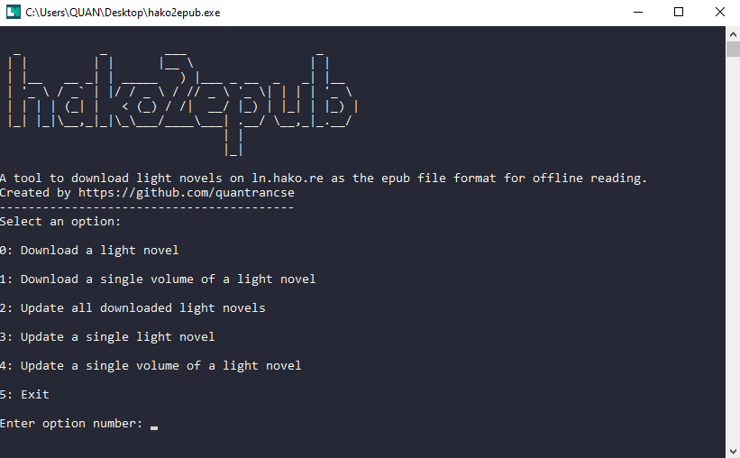

![Python Version][python-shield]
[![MIT License][license-shield]][license-url]

<!-- PROJECT LOGO -->
<br />
<p align="center">
    </img>

  <h2 align="center">hako2epub</h2>

  <p align="center">
    A tool to download light novel on <a href=https://ln.hako.re/>ln.hako.re</a> as epub file format
    <br />
    <br />
    <a href="https://github.com/quantrancse/hako2epub/releases">Download</a>
    ·
    <a href="#screenshots">Screenshots</a>
    ·
    <a href="#usage">Script Usage</a>
  </p>
</p>

<!-- TABLE OF CONTENTS -->
## Table of Contents

- [Table of Contents](#table-of-contents)
- [About The Project](#about-the-project)
  - [Features](#features)
- [Getting Started](#getting-started)
  - [Prerequisites](#prerequisites)
  - [Usage](#usage)
  - [Notes](#notes)
- [Screenshots](#screenshots)
- [Issues](#issues)
- [Contributing](#contributing)
- [License](#license)
- [Contact](#contact)
- [Acknowledgements](#acknowledgements)

<!-- ABOUT THE PROJECT -->
## About The Project

A tool to download light novels on [ln.hako.re](https://ln.hako.re) as the epub file format for offline reading.

**_Notes:_**
* _This tool is a personal standalone project, it does not have any related to [ln.hako.re](https://ln.hako.re) administrators._
* _If possible, please support the website and light novel translation authors._
* _This tool is for non-commercial purpose only._

### Features
* Support images.
* Support navigation and table of contents.
* Download all/single volume of a light novel.
* Update all/single downloaded light novel.
  * Update new volumes.
  * Update new chapters.
  * Update new chapters of a single volume.
* Working with [docln.net](https://docln.net/).

<!-- GETTING STARTED -->
## Getting Started

For normal user, there is a single execution file [here](https://github.com/quantrancse/hako2epub/releases). Run and follow the instructions.

### Prerequisites

* python 3.6.8
* ebooklib
* bs4
* pillow
* argparse
```sh
pip install ebooklib bs4 pillow argparse
```
**_Notes:_** _I only tested on python 3.6.8_

### Usage
```bash
usage: hako2epub.py [-h] [-v ln_url] [-u [ln_url]] [-uv ln_url] [ln_url]

positional arguments:
  ln_url                url to the ln homepage

optional arguments:
  -h, --help            show this help message and exit
  -v ln_url, --volume ln_url
                        download single volume
  -u [ln_url], --update [ln_url]
                        update all/single ln
  -uv ln_url, --updatevol ln_url
                        update single volume
```
* Download a light novel
```sh
python hako2epub.py light_novel_url
```
* Download a single volume in a light novel
```sh
python hako2epub.py -v light_novel_url
```
* Update all light novels
```sh
python hako2epub.py -u
```
* Update a single light novel
```sh
python hako2epub.py -u light_novel_url
```
* Update a single volume in a light novel
```sh
python hako2epub.py -uv light_novel_url
```
### Notes
* Light novel will be downloaded into the same folder as the program.
* Downloaded information will be saved into `ln_info.json` file located in the same folder as the program.
* If you change anything (like move the epub files away), try to change the `ln_info.json` too.
* Or try not to change anything ^^

## Screenshots


<!-- ISSUES -->
## Issues

* I only tested on some of my favorite light novels.
* Some images have a blank page before them (Caused by the center image code).
* Images may crash on some epub readers.

<!-- CONTRIBUTING -->
## Contributing

Contributions are what make the open source community such an amazing place to be learn, inspire, and create. Any contributions you make are **greatly appreciated**.

1. Fork the Project
2. Create your Feature Branch (`git checkout -b feature/AmazingFeature`)
3. Commit your Changes (`git commit -m 'Add some AmazingFeature'`)
4. Push to the Branch (`git push origin feature/AmazingFeature`)
5. Open a Pull Request

<!-- LICENSE -->
## License

Distributed under the MIT License. See [LICENSE][license-url] for more information.

<!-- CONTACT -->
## Contact

* **Author** - [@quantrancse](https://www.facebook.com/quantrancse)

<!-- ACKNOWLEDGEMENTS -->
## Acknowledgements
* [EbookLib](https://github.com/aerkalov/ebooklib)

<!-- MARKDOWN LINKS & IMAGES -->
[python-shield]: https://img.shields.io/badge/python-3.6.8-brightgreen?style=flat-square
[license-shield]: https://img.shields.io/github/license/quantrancse/nettruyen-downloader?style=flat-square
[license-url]: https://github.com/quantrancse/hako2epub/blob/master/LICENSE
