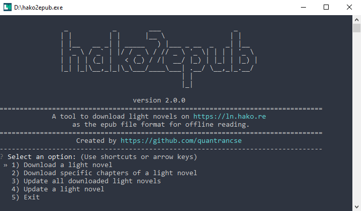

![Python Version][python-shield]
[![MIT License][license-shield]][license-url]
[](https://sonarcloud.io/dashboard?id=quantrancse_hako2epub)

<!-- PROJECT LOGO -->
<br />
<p align="center">
    </img>

  <h2 align="center">hako2epub</h2>

  <p align="center">
    A tool to download light novels from <a href=https://ln.hako.vn/>ln.hako.vn</a> in epub file format for offline reading.
    <br />
    <br />
    <a href="https://rebrand.ly/hako2epub">Download</a>
    ·
    <a href="#screenshots">Screenshots</a>
    ·
    <a href="#usage">Script Usage</a>
  </p>
</p>

<!-- TABLE OF CONTENTS -->
## Table of Contents

- [Table of Contents](#table-of-contents)
- [About The Project](#about-the-project)
  - [Features](#features)
- [Getting Started](#getting-started)
  - [Prerequisites](#prerequisites)
  - [Usage](#usage)
  - [Notes](#notes)
- [Screenshots](#screenshots)
- [Issues](#issues)
- [Contributing](#contributing)
- [License](#license)
- [Contact](#contact)
- [Acknowledgements](#acknowledgements)

<!-- ABOUT THE PROJECT -->
## About The Project

A tool to download light novels from [ln.hako.vn](https://ln.hako.vn) in epub file format for offline reading.

**_Notes:_**
* _This tool is a personal standalone project, it does not have any related to [ln.hako.vn](https://ln.hako.vn) administrators._
* _If possible, please support the original light novel, hako website, and light novel translation authors._
* _This tool is for non-commercial purpose only._

### Features
* Working with [docln.net](https://docln.net/).
* Support images.
* Support navigation and table of contents.
* Notes are shown directly in the light novel content.
* Download all/single volume of a light novel.
* Download specific chapters of a light novel.
* Update all/single downloaded light novel.
  * Update new volumes.
  * Update new chapters.
* Support multiprocessing to speed up.
* Auto get current downloaded light novel in the directory.
* Auto checking the new tool version.

<!-- GETTING STARTED -->
## Getting Started

For normal user, download the execution file below. Run and follow the instructions.

**Windows**: [hako2epub.exe ~ 14MB](https://rebrand.ly/hako2epub)

### Prerequisites

* python 3.9.6
* ebooklib
* requests
* bs4
* pillow
* tqdm
* questionary
* argparse
```sh
pip install ebooklib requests bs4 pillow argparse tqdm questionary
```

### Usage
```text
usage: hako2epub.py [-h] [-c ln_url] [-u [ln_url]] [ln_url]

A tool to download light novels from https://ln.hako.vn in epub file format for offline reading.

positional arguments:
  ln_url                url to the light novel page

optional arguments:
  -h, --help            show this help message and exit
  -c ln_url, --chapter ln_url
                        download specific chapters of a light novel
  -u [ln_url], --update [ln_url]
                        update all/single light novel
```
* Download a light novel
```sh
python hako2epub.py light_novel_url
```
* Download specific chapters of light novel
```sh
python hako2epub.py -c light_novel_url
```
* Update all downloaded light novels
```sh
python hako2epub.py -u
```
* Update a single downloaded light novel
```sh
python hako2epub.py -u light_novel_url
```
### Notes
* After processing 190 requests at a time, the program will pause for 120 seconds (2 mins) to avoid spam blocking. Please be patient if it hangs.
* Light novel will be downloaded into the same folder as the program.
* Downloaded information will be saved into `ln_info.json` file located in the same folder as the program.
* If you download specific chapters of a light novel, please enter the full name of the chapter in the "from ... to ..." prompt.
* If you update the volume which contains specific chapters, only new chapters after the current latest chapter will be added.
* Try to keep the program and `ln_info.json` file at the same folder with your downloaded light novels for efficiently management.

## Screenshots


<!-- ISSUES -->
## Issues

* I only tested on some of my favorite light novels.
* Sometimes the tool can not get images from some image hosts.
* Sometimes you have to wait (most cases are under 10 seconds) to download or update the light novels (maybe only the first light novel in the list). If you are over that time, you should use a VPN (1.1.1.1 Cloudflare WARP) to avoid this.
* If you update the light novel that was renamed, it will download the whole light novel again. To avoid this, please manually rename the path of the epub file to the new light novel name exactly like the current name format. Also rename the light novel in the `ln_info.json` file.

<!-- CONTRIBUTING -->
## Contributing

Contributions are what make the open source community such an amazing place to be learn, inspire, and create. Any contributions you make are **greatly appreciated**.

1. Fork the Project
2. Create your Feature Branch (`git checkout -b feature/AmazingFeature`)
3. Commit your Changes (`git commit -m 'Add some AmazingFeature'`)
4. Push to the Branch (`git push origin feature/AmazingFeature`)
5. Open a Pull Request

<!-- LICENSE -->
## License

Distributed under the MIT License. See [LICENSE][license-url] for more information.

<!-- CONTACT -->
## Contact

* **Author** - [@quantrancse](https://quantrancse.github.io)

<!-- ACKNOWLEDGEMENTS -->
## Acknowledgements
* [EbookLib](https://github.com/aerkalov/ebooklib)

<!-- MARKDOWN LINKS & IMAGES -->
[python-shield]: https://img.shields.io/badge/python-3.9.7-brightgreen?style=flat-square
[license-shield]: https://img.shields.io/github/license/quantrancse/hako2epub?style=flat-square
[license-url]: https://github.com/quantrancse/hako2epub/blob/master/LICENSE
